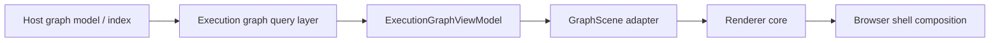

# Terminal Depth Renderer-First Web TUI System

Status: Seed design note for the `terminal-depth` renderer project

Companion docs:

- `docs/design/terminal-depth-style-manifesto.md` is the source of truth for
  aesthetic and behavioral intent.
- `docs/plans/v1-execution-plan.md` is the source of truth for delivery order,
  phase gates, and verification scope.

## Objective

Build `terminal-depth` as a renderer-first web TUI system for directed
execution graphs. The engine is a real 3D scene, but the result should read
like a terminal that has discovered depth, motion, and presence without
surrendering discipline.

The project should remain reusable from external host applications, starting
with the sibling `markdown-issue-spec` repository. The renderer core remains
the engine, `GraphScene` remains the hard seam, and the v1 delivery surface
includes a browser-first shell that proves the `Living Prompt` and
`Ghost Ledger` direction in a usable interface rather than in a naked canvas.

## Context / Constraints

- The primary integration target is the sibling `markdown-issue-spec`
  repository, which currently defines graph semantics, modeling guidance, and
  an API-first system plan. UI is explicitly not part of its first milestone.
- `terminal-depth` should be reusable without depending on a host's Markdown
  issue format, Bun server internals, or SQLite schema.
- The hard seam remains a versioned, JSON-serializable `GraphScene` contract.
- The design should favor constrained 2.5D rather than unconstrained 3D graph
  physics.
- The resting view must remain readable from one stable camera angle.
- The first-class v1 proving ground is a browser-first web TUI shell in
  `apps/playground`.
- The browser shell is a product surface for v1, but it is not yet a new
  public shell API.
- Realistic lighting is a non-goal. Terminal vibes hate physically based
  rendering.

## Materially verifiable success criteria

- [ ] A host application can pass a versioned `GraphScene` object to the
      renderer and get an interactive visualization inside a browser-first web
      TUI shell without the renderer importing host-specific issue types.
- [ ] The default layout is deterministic, DAG-friendly, and readable from a
      stable camera without requiring a free-orbit camera to understand the
      graph.
- [ ] The interaction and shell model express `Living Prompt` and
      `Ghost Ledger` through prompt-state controls, inspection surfaces,
      overlays, and scene focus behavior that improve comprehension.
- [ ] The visual pipeline uses low-resolution offscreen rendering,
      quantization, dithering, glyph treatment, cell-grid snapping, and subtle
      finishing passes to produce a TUI-like look.
- [ ] The project includes benchmark and hero scenes plus a browser shell that
      allow quality, legibility, and shell-level behavior to be judged
      together.

## Execution notes

- Treat the manifesto as aesthetic truth, this note as architecture truth, and
  the v1 plan as execution truth.
- Keep the hard seam at `GraphScene`, not at raw issue files and not at final
  pixels.
- Allow layout to be owned either by the host application or by an optional
  helper package in this project.
- Start web-first for speed of iteration and flexible embedding.
- Prove shell composition patterns in `apps/playground` before considering any
  reusable shell API.
- Do not let the graph become beautiful soup.

## 1. Design Summary

The project should not be "a 3D graph toy" and it should not be flat terminal
cosplay. It should be a constrained graph display system with a browser shell
that makes the terminal feel alive while remaining spare and operational.

Defaults:

- Use a deterministic layered DAG layout for the base structure.
- Reserve `z` for semantic meaning such as hierarchy depth, execution phase,
  criticality, or cluster grouping.
- Use an orthographic camera or very low-field-of-view perspective by default.
- Support focus, hover, filtering, and inspection interactions, but keep the
  resting view disciplined and legible.
- Render a real 3D scene, then stylize it through a fake-terminal pipeline.
- Compose the scene inside a shell that reads like an expanded prompt state,
  not a pile of floating widgets.

Two anchor metaphors from the manifesto should guide decisions:

### Living Prompt

The interface should feel like prompt state gaining dimensional form.

- Focus should feel like the terminal isolating the active thought.
- Reveals should feel like output unfolding with intent.
- Prompt and control surfaces should anchor the user's sense of current mode,
  scene, and selection.

### Ghost Ledger

The graph should read like a living ledger of execution state.

- Routes, labels, clusters, panes, and annotations should feel archived,
  indexed, and inspectable.
- Depth should clarify order, hierarchy, and causality rather than advertise
  itself as spectacle.

The result should feel like a terminal hallucinating depth rather than a game
engine pretending to be Jira.

## 2. Why This Should Be Its Own Project

Keeping this as a dedicated renderer-first web TUI project is the cleanest path
for a few reasons:

- Renderer iteration speed is different from spec and validation work.
- The rendering stack will likely accumulate GPU code, post-processing passes,
  shell experiments, fixtures, and design notes that do not belong in a host
  repository.
- A stable scene contract makes the renderer reusable for other DAG-like
  systems later.
- Keeping the boundary clean reduces the risk that a host application
  accidentally grows a tightly coupled UI subsystem before its server and
  graph-query layers are mature.

## 3. Recommended Seam

The hard seam should remain a versioned scene contract:

`ExecutionGraphViewModel -> GraphScene -> Renderer Core`

Inside `terminal-depth`, the renderer core and web TUI shell can be layered
separately, but the public seam still stops at `GraphScene`.

Recommended mapping flow:



Responsibilities by side of the seam:

### Host application owns

- Domain semantics and validation
- Graph relationships such as dependencies, hierarchy, and related links
- Derived execution state such as blocked, ready, active, done, critical path,
  and grouping hints
- Optional layout hints or precomputed positions if desired
- Any host-specific storage, transport, or navigation concerns

### `terminal-depth` owns

- Camera model
- Scene graph
- Rendering backend
- Post-processing passes
- Glyph and cell-grid treatment
- Terminal-like palette treatment
- Interaction model for focus, hover, navigation, and inspection
- Reference shell composition patterns proved in `apps/playground`
- Prompt-state behavior, overlay grammar, and inspection surfaces above the
  scene

### Shared contract owns

- A versioned scene schema
- Stable semantics for nodes, edges, clusters, themes, and emphasis
- Enough metadata to render a scene without understanding the host domain model

## 4. Scene Contract

The first public contract should be JSON-serializable and versioned. It should
be expressive enough for rendering, but small enough to remain stable.

```ts
export type GraphScene = {
  version: "graph-scene/v1";
  nodes: GraphSceneNode[];
  edges: GraphSceneEdge[];
  clusters?: GraphSceneCluster[];
  camera?: GraphSceneCamera;
  theme?: GraphSceneTheme;
  annotations?: GraphSceneAnnotation[];
};

export type GraphSceneNode = {
  id: string;
  label: string;
  position: { x: number; y: number; z: number };
  size?: number;
  state?: "idle" | "active" | "blocked" | "done";
  colorRole?: string;
  glyphRole?: string;
  emphasis?: number;
  clusterId?: string;
  metadata?: Record<string, string | number | boolean | null>;
};

export type GraphSceneEdge = {
  id: string;
  source: string;
  target: string;
  kind: string;
  state?: "idle" | "active" | "blocked";
  colorRole?: string;
  pulse?: number;
  route?: Array<{ x: number; y: number; z: number }>;
};

export type GraphSceneCluster = {
  id: string;
  label: string;
  boundsHint?: { x: number; y: number; z: number; w: number; h: number; d: number };
  colorRole?: string;
};

export type GraphSceneCamera = {
  mode: "orthographic" | "perspective";
  fov?: number;
  position: { x: number; y: number; z: number };
  target: { x: number; y: number; z: number };
};

export type GraphSceneTheme = {
  palette: "ansi" | "green-phosphor" | "amber" | "custom";
  cellSize?: { cols: number; rows: number };
  postprocessPreset?: string;
};

export type GraphSceneAnnotation = {
  id: string;
  label: string;
  anchorNodeId?: string;
  position?: { x: number; y: number; z: number };
};
```

Contract guidance:

- Positions are allowed to be precomputed by the host.
- Layout helpers may exist in this project, but rendering should not require
  the renderer to understand the host's issue semantics.
- Theme data is renderer-facing and shell-facing only. It must not carry
  host-domain semantics.
- `metadata` is allowed for local experimentation, but the renderer should only
  rely on documented fields for public behavior.
- New contract versions should be additive when possible.
- v1 does not add a shell schema to `GraphScene`. Shell composition remains an
  internal proving ground above the stable seam.

## 5. Layout Model

The default layout strategy should be deterministic and DAG-aware.

### Base rules

- Primary axis should represent execution order or topological progression.
- Secondary axis should separate siblings, branches, or clusters.
- `z` should represent semantic depth rather than arbitrary spatial drift.

### Good candidates for semantic `z`

- Hierarchy depth
- Execution phase
- Criticality
- Cluster grouping
- Confidence or certainty bands

### Layout principles

- Stable input should produce stable output.
- Adjacent layers should minimize edge crossings.
- Long dependency chains should read clearly without deep camera movement.
- Multi-parent nodes should remain readable even if they bridge clusters.
- Cluster boundaries should be explicit without turning into giant boxes
  everywhere.
- Default framing should leave enough negative space for shell overlays and
  prompt-state surfaces to coexist with the scene.

Force simulation can exist as an optional experimental mode, but it should not
be the default. The default should be deterministic and explainable.

## 6. Camera, Interaction, and Shell Model

Default camera behavior matters because it determines whether the scene reads
like an instrument panel or a space screensaver. Shell behavior matters because
it determines whether that instrument feels like a living prompt or a chrome
problem.

Recommended camera defaults:

- Orthographic camera first
- Perspective only as a low-FOV option
- Stable overview framing
- Smooth focus and pan transitions
- Optional orbit for inspection
- Recenter and "follow active path" affordances

Interaction goals:

- Hover should reveal identity and local neighborhood.
- Focus should isolate a node, path, cluster, or subgraph.
- Filtering should hide noise before the user reaches for freeform camera
  movement.
- The user should not need to constantly rotate the scene to understand it.

Shell goals:

- The prompt and control surface should communicate current mode, scene, and
  focus state.
- Inspector panes should make the selected node, neighborhood, or path feel
  indexed rather than improvised.
- Keyboard and pointer flows should reinforce inspection without creating a
  second disconnected UI language above the scene.
- Overlays should feel fabricated from terminal primitives, not from generic
  dashboard chrome.

## 7. Rendering Pipeline

The TUI-like treatment should come from the render pipeline and shell
composition together, not from drawing fake terminal widgets over a 2D scene.

Recommended pipeline:

1. Normalize scene data and resolve defaults.
2. Compute or apply positions and routes.
3. Render the 3D scene into a low-resolution offscreen buffer.
4. Quantize the image into an ANSI-like or phosphor-inspired palette.
5. Apply ordered dithering or error diffusion.
6. Generate a glyph or block-character representation from luminance, edges,
   and depth.
7. Snap labels and line endpoints to a character-cell grid in the final
   compositing stage.
8. Upscale using nearest-neighbor or similarly crisp sampling.
9. Apply restrained finishing passes.

Recommended finishing passes:

- Subtle bloom for emissive edges and active nodes
- Scanlines
- Light ghosting or temporal persistence
- Depth-aware fog quantized into bands
- Posterized depth outlines
- Very subtle CRT-like barrel distortion

Avoid:

- Heavy chromatic aberration
- Film-grain overload
- Dramatic perspective distortion
- Physically based materials
- Dense drop shadows and realistic lighting

## 8. Visual Language

The visual system should feel intentional, instrument-like, and slightly
uncanny.

Recommended style directions:

- Unlit or emissive materials
- Strong silhouette and contrast
- Small, deliberate color vocabulary
- Character-cell logic that influences the final image even when the scene is
  still technically 3D
- Motion used to reveal state, not to decorate
- Prompt lines, rules, panes, and overlays that feel closer to terminal grammar
  than generic dashboard furniture

Good motion candidates:

- Pulses moving along active edges
- Slow temporal persistence on recent execution paths
- Cluster emphasis on focus
- Brief reveal sweeps when filters change
- Prompt and inspector transitions that read as procedural state changes rather
  than theatrical animation

Failure modes:

- Sci-fi dashboard overload
- Fake hacker terminal cosplay
- Effects that obscure labels, routes, or graph structure
- Shell chrome that feels detached from the scene below it

## 9. Package Boundaries

A clean standalone project should look like this for v1:

```text
terminal-depth/
  packages/
    scene-contract/
    renderer-core/
    layout-dag/
    terminal-style/
  apps/
    playground/
  docs/
    design/
      terminal-depth-renderer.md
      terminal-depth-style-manifesto.md
    plans/
      v1-execution-plan.md
```

Recommended ownership:

- `scene-contract`: public types, versioned schemas, fixtures
- `renderer-core`: scene setup, camera, render loop, interactions
- `layout-dag`: optional deterministic layout helpers
- `terminal-style`: quantization, dithering, glyph pass, finishing passes
- `playground`: browser-first web TUI shell, scene switching, inspection
  surfaces, and evaluation controls for benchmark and hero scenes

Only `scene-contract` and `renderer-core` need to be treated as truly public at
the start. The shell should be real in v1, but it remains a proving ground in
`apps/playground`.

## 10. Integration Into `markdown-issue-spec`

The first host integration target should consume `terminal-depth` through a
thin adapter and compose the renderer inside a shell that respects the same
discipline proven in the playground.

Recommended integration shape:

1. Query or derive the execution graph from the host server/index layer.
2. Normalize the result into an `ExecutionGraphViewModel`.
3. Map that view model into `GraphScene`.
4. Pass `GraphScene` to the renderer core.
5. Compose renderer focus, filters, and inspection state into a host-owned
   shell surface.

The adapter should live on the host application's side of the seam.

Possible future touch points in `markdown-issue-spec`:

- A graph query layer under `server/core/graph/`
- A route or transport adapter that can return graph data for visualization
- A host-side adapter that maps execution state to `GraphScene`
- A host-side shell that borrows the prompt, overlay, and inspection patterns
  proven in `apps/playground` without being forced into the exact same chrome

Important rule:

`terminal-depth` must not need to know what Markdown frontmatter is, what an
`IssueEnvelope` is, or how the local index is stored.

## 11. Bootstrap Plan

Recommended sequence:

### Phase 1: Contract, fixtures, and docs

- Define `graph-scene/v1`
- Create a small set of canonical fixture scenes
- Decide the baseline theme preset
- Write the contract guide and shell-composition guidance

### Phase 2: Layout helper and scene normalization

- Implement deterministic layered DAG layout
- Add edge routing
- Derive default framing and normalization behavior
- Tune the resting view so shell overlays can coexist with graph readability

### Phase 3: Core renderer and web TUI shell

- Render nodes, edges, labels, and focus interactions
- Support deterministic precomputed positions
- Establish camera behavior and scene framing
- Build a browser-first shell with prompt-state controls, inspector panes, and
  benchmark/hero scene switching

### Phase 4: Terminal styling and integration path

- Add low-resolution offscreen rendering
- Add palette quantization
- Add dithering
- Add glyph treatment
- Add cell snapping
- Add finishing passes
- Validate that the same scene contract can drive both the shell proving ground
  and a real host integration

## 12. Bootstrap Prompt

Use the following as a seed prompt when starting implementation:

```md
Build a renderer-first web TUI system for directed execution graphs that uses a
real 3D scene but visually and behaviorally reads like a terminal.

Constraints:
- Use constrained 2.5D, not unconstrained 3D graph physics.
- Base layout should be deterministic and DAG-friendly.
- Reserve `z` for semantic meaning such as hierarchy depth, execution phase,
  criticality, or cluster grouping.
- Default camera should be orthographic or very low-FOV perspective.
- Use a real 3D scene followed by a fake-terminal render pipeline.
- Compose the scene inside a browser shell that expresses Living Prompt and
  Ghost Ledger.
- Use unlit or emissive materials, not physically based rendering.

Required seam:
- The system must consume a versioned, JSON-serializable `GraphScene`
  contract.
- The renderer must not depend on the host application's issue schema,
  Markdown storage, or server internals.
- Do not introduce a new public shell API in v1.

Required capabilities:
- Render nodes, edges, labels, clusters, and annotations
- Support host-provided positions and optional internal layout helpers
- Render through a low-resolution offscreen buffer
- Apply palette quantization and dithering
- Apply glyph or block-character treatment
- Snap labels and line endpoints to a character-cell grid
- Upscale crisply and apply restrained finishing passes such as bloom,
  scanlines, light ghosting, depth-banded fog, and posterized depth outlines
- Support focus, hover, filtering, active-path highlighting, prompt-state
  controls, and inspection surfaces

Deliverables:
- Public `graph-scene/v1` contract
- Renderer core package
- Terminal-style post-processing package
- Playground app that serves as the initial browser-first shell
- One benchmark scene and one hero scene
- Short integration guide for embedding the renderer into a host execution-graph
  application and composing it into a host-owned shell
```

## 13. Integration References

Useful context in the sibling `markdown-issue-spec` repository:

- `../markdown-issue-spec/docs/spec.md`
- `../markdown-issue-spec/docs/modeling.md`
- `../markdown-issue-spec/docs/plans/agent-first-mvp.md`
